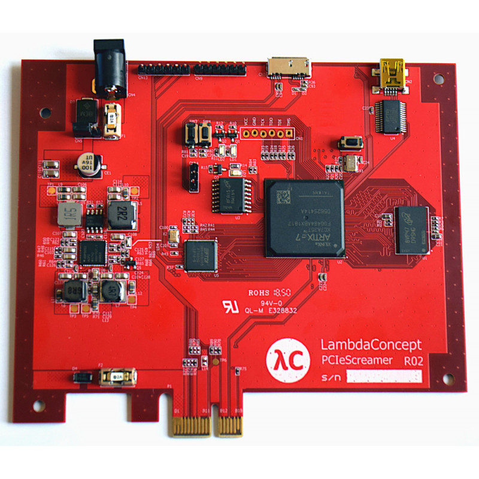

# GO-PCIe-Screamer

## About

[PCIe screamer](https://shop.lambdaconcept.com/) is an FPGA PCIe board developed
by LambdaConcept. The device supports raw PCIe Transaction Layer Packet (TLP)
access, and helps security researchers assess the host's PCIe security.



[LeechCore](https://github.com/ufrisk/LeechCore), developed by Ulf Frisk, is a
low-level software library that interacts with the screamer. For additional
information, see <https://github.com/ufrisk/LeechCore/wiki/Device_FPGA>.

`go-pcie-screamer` is a re-implementation of LeechCore software stack, written
in Go.

## Hardware setup

Download the v4 bitstream from
<https://github.com/ufrisk/pcileech-fpga/tree/master/pciescreamer>, and follow
the flashing instructions at
<http://blog.lambdaconcept.com/doku.php?id=products:pcie_screamer>.

## Usage

```go
import "github.com/google/go-pcie-screamer/screamer"

// Enumerates and opens all screamer devices on the system.
devs, err := screamer.OpenScreamers()
if err != nil {
    return nil, err
}

// Closes screamers on exit.
defer func() {
    for _, d := range devs {
        d.Close()
    }
}()

// Creates an io.ReadWriter for reading and writing TLPs.
rw = screamer.NewTLPController(devs[0])

// Writes a single TLP.
tlp := []byte{0xaa, 0xaa, 0xaa, 0xaa}
rw.Write(tlp)

// Reads a single TLP (with timeout).
b := make([]byte, 1024)
n, err := rw.Read(b)
```

## Supported Hardware

`go-pcie-screamer` was only tested on PCIeScreamer R02 PCIe board, however,
other PCILeech FPGA devices may be supported.

## License

This project is a derivative work of LeechCore, therefore, it is licensed under GPLv3, as
the original work.

## Disclaimer

This is not an official Google product (experimental or otherwise), it is just
code that happens to be owned by Google.
